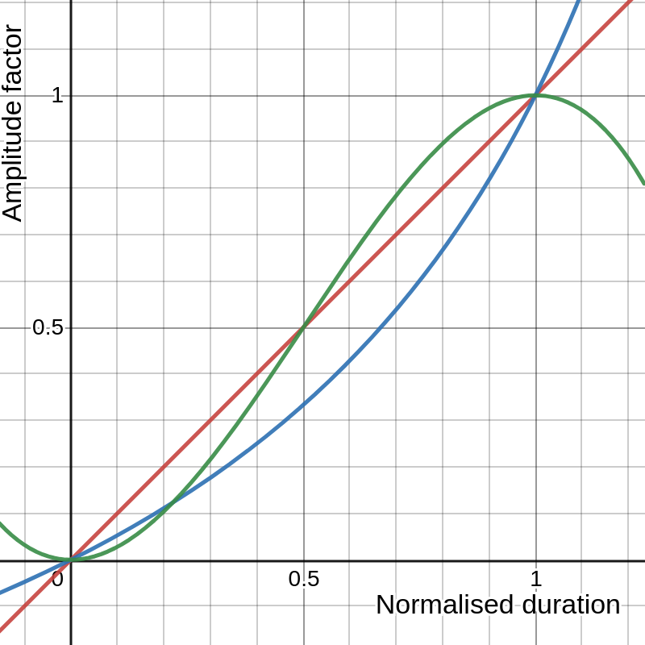

# Home Assistant Media Player Volume Fade

This script fades the volume of a `target_player` media player, starting at it's current `volume_level`, to a user-defined `target_volume` over the user-defined `duration` in seconds. It also applies one of three `curve` algorithms to shape fade, defaulting to `logarithmic`, which is often considered the most natural sounding fade.

I struggled to find any comprehensive solutions on the Home Assistant forums for fading media player volumes with common attenuation curves. I really don't like abrupt changes to audio volume, so I put this script together.

For those interested, the script is fully commented, and I've put together a quick explanation of the script's working below.

## Input Parameters
- **target_player**: media_player entity
- **target_volume**: float 0 - 1 --- volume to end at
- **duration**: float 0.1 - 60 --- duration of fade in seconds 
- **curve**: selector [logarithmic, bezier, linear]

## Working

The script works first calculating the number of `total_steps` required to fade based on the user-defined `duration` multiplied by a hard-coded `step_duration` of `100ms` (or 10 per second). For example, a duration of 5 seconds equates to 500 steps.

It determines the difference between the media player's current volume and the user-defined `target_volume`. It applies the difference value as a factor to the shaped fade amount, adds it to the original volume, then pushes the new volume to the media player entity `volume_level` for each step in a `while` loop.

## Timing Limitation
From what I could gather, Home Assistant calls its services on a 1 second clock. I don't know the details, however it's clear that sub-second delay calls aren't timed perfectly.

Issue: The lack of ms-accurate timing of Home Assistant's delay calls might cause slight discrepancies to fade durations. The larger the duration, the more noticeable this might become.

To make this script duration-accurate, instead of defining `total_steps`, a `steps_left` value could be used, defined by the script's `start_time`, `end_time` (which would be fixed), and the `current_time` for each iteration of the loop. The repeat condition could then use a pre-defined end-time, with the fade steps increasing or decreasing depending on if the calls are lagging or ahead..... but I've already spent way too much time on this, so be my guest :)

## Algorithms:
Where `x` is the normalised time value based on the `duration`, starting at `0` and ending at `1`.
- (red) Linear: `f(x) = x` 
- (blue) Bezier: `f(x) = x / (1 + (1 - x ))`
- (green) Logarithmic: `f(x) = x * x * (3 - 2x)`




## Script code

Add this to your Home Assistant `script` config `.yaml`, and use it anywhere that allows a service call (such as automations):

```yaml
fade_volume:
  alias: Fade the volume of a media player
  mode: restart
  fields:
    target_player:
      name: Target media player
      description: Target media player of volume fade.
      required: true
      example: media_player.lounge_sonos
      selector:
        entity:
          domain: media_player
    target_volume:
      name: Target volume
      description: Volume the media play will be at the end of the fade duration.
      required: true
      default: 0.5
      example: '0.5'
      selector:
        number:
          max: 1
          min: 0
          step: 0.01
          mode: slider
    duration:
      name: Fade duration
      description: Length of time in seconds the fade should take.
      required: true
      default: 5
      example: '5'
      selector:
        number:
          mode: box
          min: 0
          max: 100000
          unit_of_measurement: s
    curve:
      name: Fade curve algorithm
      description: Shape of the fade curve to apply.
      required: true
      default: logarithmic
      example: logarithmic
      selector:
        select:
          options:
          - logarithmic
          - bezier
          - linear
  variables:
    steps_per_second: 10
    total_steps: '{{ (steps_per_second * duration) | int(0) }}'
    start_volume: '{{ state_attr(target_player, ''volume_level'') | float(0) }}'
    start_diff: '{{ (target_volume - start_volume) | float(0) }}'
  sequence:
  - repeat:
      while:
      - condition: template
        value_template: '{{ repeat.index < total_steps }}'
      - condition: template
        value_template: '{{ ((state_attr(target_player, "volume_level") - target_volume)
          | abs) > 0.001 }}'
      sequence:
      - service: media_player.volume_set
        data_template:
          entity_id: '{{ target_player }}'
          volume_level: " \n  {{ (start_volume + (t / (1 + (1 - t))) * start_diff) | float(0)\
            \ }}\n\n  {{ (start_volume + (t * t * (3 -\
            \ 2 * t)) * start_diff) | float(0) }}\n\n  {{ (start_volume\
            \ + t * start_diff) | float(0) }}\n\n"
      - delay: '00:00:00.1'
  - service: media_player.volume_set
    data_template:
      entity_id: '{{ target_player }}'
      volume_level: '{{ target_volume }}'
  icon: mdi:tune-vertical
```
